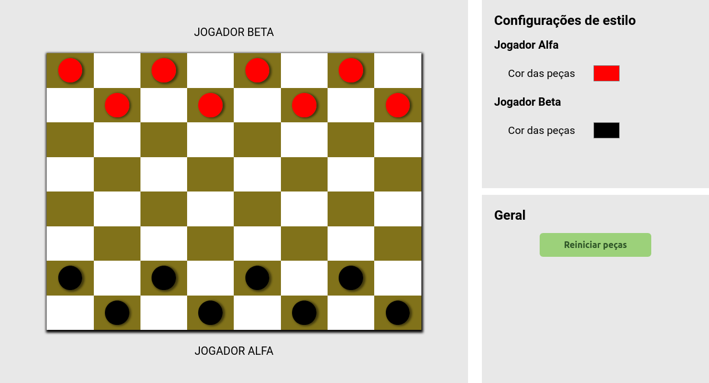

# Jogo de Dama  

Damas é um jogo popular de tabuleiro 8 x 8 em que as peças ocupam somente as casas de uma determinada cor. 

<b>Este teste possui</b> 💥

- Estrutura básica da página
- Estado inicial
- Movimentos válidos

### Obrigada pela visita 
